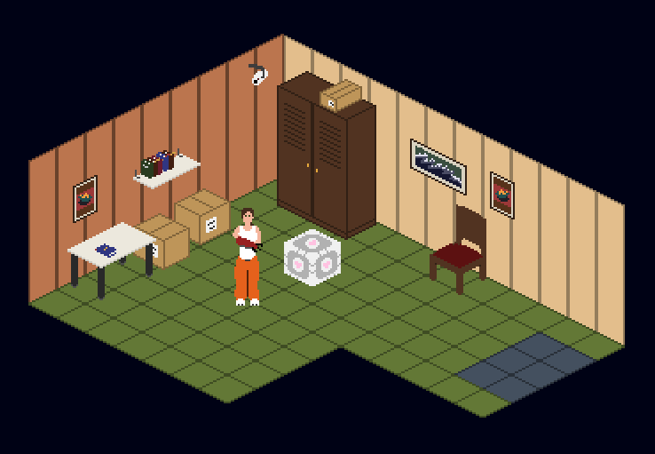

(this README is still partly LLM generated)

# AiMO Game Component Prototype

This project, built in Godot, includes client and server functionality in the same executable, and supports online multiplayer. Players can join the game, join other rooms, move around, customize their characters (not persistent), and interact with NPCs and other objects. A test NPC can request and display a quiz generated by the [multi-agent server](https://github.com/Syvxn/AiMO-Agents) component. The client is primarily designed for web browsers and therefore uses the **Compatibility** renderer and **WebSockets** multiplayer.


**Tech stack:**

- **Engine**: Godot 4.6 (GDScript only, no external dependencies)
- **Renderer**: GL Compatibility (supports mobile/web targets)
- **Networking**: Godot built-in `WebSocketMultiplayerPeer`, port 80
- **Physics**: Godot built-in 2D physics

---


## Running Locally

Either clone the repo with ``git clone <repo-url>`` or download the contents as a zip file.

Open **Godot**, click **Import**, and select the `project.godot` file from the cloned folder.

Rename ```.env_example.json``` to ```.env.json``` before attempting to run the game.
If you want the NPC to reply in chat, ```CHAT_SERVER_URL``` must point to the agent server chat endpoint.

Once you've opened the project in the Godot editor, set the number of run instances to at least 2 from **Debug -> Customize Run Instances...**

This will allow you to set one instance as the server, and the rest as clients afterward, when running the project with F5.

(Alternatively, you can export a dedicated server build, run it as an executable, and then run the client either from the editor or as a web export. Web exports must be served through an HTTP(S) server, for example with ```python3 -m http.server 8080```.)

---

## Project Structure

Files ending in ``.tscn`` are **scenes**, files ending in ``.gd`` are GDScript **scripts**.
**Most scripts are attached to scenes of the same name.**
Autoload scripts are made globally available at runtime.
Some nodes/scenes might have small built-in scripts that aren't saved separately.

The most important files/directories are:
- ``main.tscn`` & ``main.gd`` - first thing loaded by the game, contains a lot of core funcionality. other scenes end up inside this one
- ``env.json`` - make this from ``env_example.json``, contains information about the outside world
- ``autoloads/``- contains scripts that will be globally available at runtime, including signals, customization options, networking, and environment variables
- ``player/`` - contains scenes and scripts for the player character, including controls and customization
- ``textures/`` - contains 2D textures, as well as **SpriteFrames** and **TileSet** resources 
- ``ui/`` - contains menus, loading screens, and eventually the HUD
- ``rooms/`` - contains room scenes and their scripts
- ``items/`` - contains static props (with and without collision) as well as movable physics objects
- ``README.md`` - this document


---


## Good to Know

### Client/Server

The game decides whether it runs as a server or a client based on how the game has been exported. Web exports are automatically clients, dedicated server builds are servers, and anything else launches into a debug menu. 

**NOTE:** The web client is still missing the functionality that fetches/receives player info and actually spawns the player. Until this is implemented, run the client from the debug menu.


### Multiplayer Logic

Most things are done on the server and then propagated to clients using **MultiplayerSpawner** and **MultiplayerSynchronizer** nodes. When a player joins, for example, the client uses a **remote procedure call** to request a spawn from the server, which then spawns the player and automatically replicates this on clients. **Exceptions include handling of player inputs and character customization**, which happen on that player's client.

### Talking to Faraway Nodes

If Node A needs Node B to do something, and they're not in the same scene, you can declare a new globally available signal in ``autoloads/signal_bus.gd``, then have one node emit the signal and the another node connect to it with a callback. For example: 
- ``signal car_broke_down(cause: String)`` <-- signal_bus.gd
- ``SignalBus.car_broke_down.emit("tire blew out")`` <-- node_a.gd
- ``SignalBus.car_broke_down.connect(callback_method)`` <-- node_b.gd

If you need all nodes of a type and you don't know where they're going to be, add the nodes to an appropriate global group and fetch them with ``get_tree().get_nodes_in_group("group_name")``.


### Networking

*"Uh, yeah, I sure hope it does.""*

- Browsers get real pissy about WebSockets port numbers, so keep the ``GAME_SERVER_PORT`` as either 80 or 443 in ``env.json``.
- If running the [multi-agent server](https://github.com/Syvxn/AiMO-Agents) locally, keep the ``GAME_SERVER_URL`` domain name as ``localhost`` in ``env.json``. Otherwise Godot implements a mysterious 30s wait time for HTTP requests.

### Debugging

You can change stuff in the Godot editor while the game is running in debug mode, and see the effects live, but only if that function/whatever isn't currently being called.


## TODO

- **Role enforcement** - Nothing in the game actually stores or checks for teacher/student status.
- **Room gameplay** - Rooms are mostly stubs; the room logic is the main area waiting to be built out.
- **Adding/removing public rooms** - `main.gd` has stubbed `add_public_room` / `remove_public_room` functions ready to be implemented. Currently rooms other than players' personal rooms are simply placed by the developers.
- **Everything else** - This would include sound.
